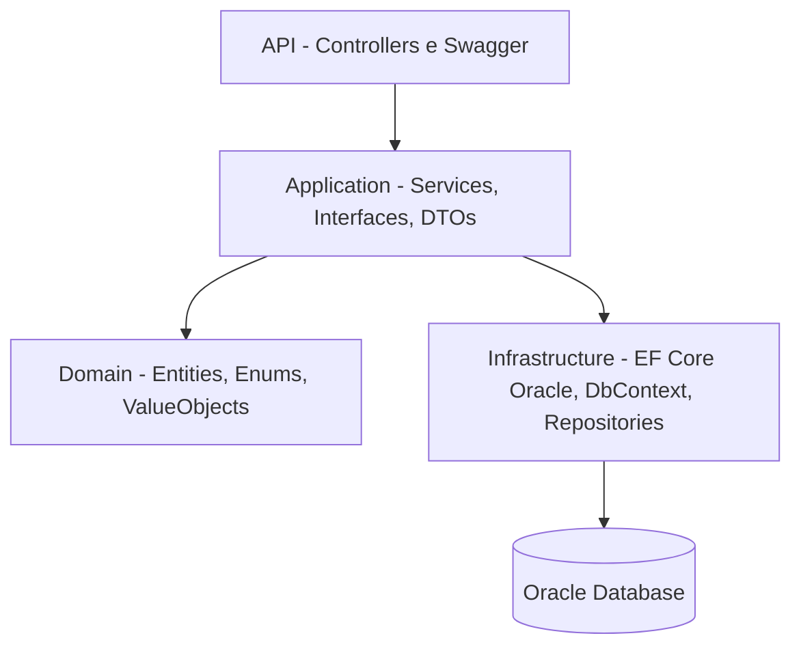

# 🌈 EqualPath – Plataforma de Inclusão Profissional

Transformando carreiras e conectando talentos a oportunidades inclusivas.  
API desenvolvida com **.NET 9**, **Oracle Database** e **Clean Architecture**.

---

## 🧭 Índice

1. [🎯 Objetivo do Projeto](#-objetivo-do-projeto)  
2. [🧩 Visão Geral e Arquitetura](#-visão-geral-e-arquitetura)  
3. [⚙️ Tecnologias Utilizadas](#️-tecnologias-utilizadas)  
4. [🏗️ Estrutura do Projeto](#️-estrutura-do-projeto)  
5. [🗄️ Banco de Dados – Oracle](#️-banco-de-dados--oracle)  
6. [🌐 Endpoints da API](#-endpoints-da-api)  
7. [💾 Exemplos de Requisição](#-exemplos-de-requisição)  
8. [⚠️ Erros Comuns e Soluções](#️-erros-comuns-e-soluções)  
9. [🚀 Melhorias Futuras](#-melhorias-futuras)  
10. [👩‍💻 Autora](#-autora)

---

## 🎯 Objetivo do Projeto

O **EqualPath** conecta talentos a oportunidades profissionais inclusivas, oferecendo recursos modernos para gestão de vagas, empresas e candidatos.

**Principais objetivos:**
- Reduzir desigualdade no acesso ao mercado de trabalho.  
- Facilitar busca e cadastro de oportunidades.  
- Aplicar Clean Architecture com boas práticas.  
- Criar uma API robusta e escalável com .NET + Oracle.  

---

## 🧩 Visão Geral e Arquitetura

O projeto segue **Clean Architecture**, garantindo organização, baixa dependência e suporte à escalabilidade.



---

## ⚙️ Tecnologias Utilizadas

| Categoria | Tecnologia |
|----------|------------|
| Linguagem | **C# 12 (.NET 9)** |
| Framework Web | **ASP.NET Core Web API** |
| ORM | **Entity Framework Core Oracle Provider (7.21.8)** |
| Banco de Dados | **Oracle Database 19c (FIAP)** |
| Documentação | **Swagger / Swashbuckle** |
| Arquitetura | **Clean Architecture** |
| Comunicação | **REST API** |

---

## 🏗️ Estrutura do Projeto

```bash
src/
├── EqualPath.Api
│   ├── Controllers
│   ├── Configurations
│   ├── Extensions
│   └── Program.cs
│
├── EqualPath.Application
│   ├── DTOs
│   ├── Interfaces
│   └── Services
│
├── EqualPath.Domain
│   ├── Entities
│   ├── Enums
│   └── ValueObjects
│
└── EqualPath.Infrastructure
    ├── Data
    ├── Mappings
    └── Repositories
```

---

## 🗄️ Banco de Dados – Oracle

### 🧱 Criação das Tabelas

```sql
CREATE TABLE EMPRESAS (
    ID NUMBER GENERATED BY DEFAULT ON NULL AS IDENTITY PRIMARY KEY,
    NOME VARCHAR2(160 CHAR) NOT NULL,
    CNPJ VARCHAR2(18 CHAR),
    CIDADE VARCHAR2(100 CHAR),
    SITE VARCHAR2(200 CHAR)
);

CREATE INDEX IDX_EMPRESAS_NOME ON EMPRESAS (NOME);

CREATE TABLE VAGAS (
    ID NUMBER GENERATED BY DEFAULT ON NULL AS IDENTITY PRIMARY KEY,
    TITULO VARCHAR2(160 CHAR) NOT NULL,
    DESCRICAO VARCHAR2(4000 CHAR),
    HABILIDADES VARCHAR2(300 CHAR),
    SENIORIDADE NUMBER(2) NOT NULL,
    TIPOCONTRATO NUMBER(2) NOT NULL,
    CIDADE VARCHAR2(100 CHAR),
    CRIADAEM DATE DEFAULT SYSDATE NOT NULL,
    EMPRESAID NUMBER NOT NULL,
    CONSTRAINT FK_VAGAS_EMPRESA FOREIGN KEY (EMPRESAID) REFERENCES EMPRESAS(ID)
);

CREATE INDEX IDX_VAGAS_FILTROS ON VAGAS (CIDADE, SENIORIDADE, TIPOCONTRATO);

CREATE TABLE CANDIDATES (
    ID NUMBER GENERATED BY DEFAULT ON NULL AS IDENTITY PRIMARY KEY,
    FULL_NAME VARCHAR2(200 CHAR) NOT NULL,
    EMAIL VARCHAR2(200 CHAR) NOT NULL
);
```

---

## 🌐 Endpoints da API

### 👤 Candidatos
| Método | Rota | Descrição |
|--------|------|-----------|
| GET | `/api/candidates` | Lista todos |
| GET | `/api/candidates/{id}` | Busca por ID |
| POST | `/api/candidates` | Cria candidato |
| PUT | `/api/candidates/{id}` | Atualiza |
| DELETE | `/api/candidates/{id}` | Remove |

### 🏢 Empresas
| Método | Rota | Descrição |
|--------|------|-----------|
| GET | `/api/empresa` | Lista |
| GET | `/api/empresa/{id}` | Busca por ID |
| POST | `/api/empresa` | Cria |
| PUT | `/api/empresa/{id}` | Atualiza |
| DELETE | `/api/empresa/{id}` | Remove |

### 💼 Vagas
| Método | Rota | Descrição |
|--------|------|-----------|
| GET | `/api/vaga` | Lista vagas |
| GET | `/api/vaga/{id}` | Detalhes |
| POST | `/api/vaga` | Cria vaga |
| PUT | `/api/vaga/{id}` | Atualiza |
| DELETE | `/api/vaga/{id}` | Remove |
| GET | `/api/vaga/search` | Busca com filtros |

---

## 💾 Exemplos de Requisição

### 🔹 Criar Candidato
```json
{
  "fullName": "Maria Eduarda",
  "email": "maria@gmail.com"
}
```

### 🔹 Criar Empresa
```json
{
  "nome": "TechHouse",
  "cnpj": "22.222.222/0001-55",
  "cidade": "São Paulo",
  "site": "https://techhouse.com"
}
```

### 🔹 Criar Vaga
```json
{
  "titulo": "Backend C# Junior",
  "descricao": "Desenvolver APIs REST",
  "habilidades": "C#, SQL, API",
  "senioridade": 1,
  "tipoContrato": 0,
  "cidade": "São Paulo",
  "empresaId": 1
}
```

---

## ⚠️ Erros Comuns e Soluções

### ORA-12637
Falha temporária de rede (FIAP).  
**Solução:** tentar novamente.

### ORA-00942
Tabela inexistente.  
**Solução:** executar script SQL novamente.

### Value cannot be null (connectionString)
`OracleConnection` ausente no `appsettings.json`.

---

## 🚀 Melhorias Futuras

- Autenticação JWT  
- Sistema de candidatura  
- IA para recomendações de vagas  
- Dashboard para empresas  
- Métricas e histórico  
- Perfis e permissões avançadas  

---

## 👩‍💻 Autora

**Maria Eduarda Araujo Penas**  
Estudante de ADS – FIAP  


